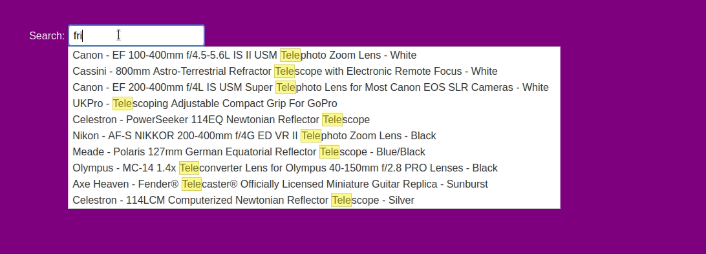

### BestBuy Autocomplete

Dataset used: [https://github.com/BestBuyAPIs/open-data-set](https://github.com/BestBuyAPIs/open-data-set)

#### Requirements
- Go 1.13
- Java 11
- Elasticsearch 7.10
- Node.js 14

#### Instructions (local)

1. `curl -L -O https://artifacts.elastic.co/downloads/elasticsearch/elasticsearch-7.10.2-linux-x86_64.tar.gz`
2. `tar -xvf elasticsearch-7.10.2-linux-x86_64.tar.gz`
3. `gunzip --keep data/products.json.gz > data/products.json`
4. `./elasticsearch-7.10.2/bin/elasticsearch -p /tmp/es-pid1 &`
5. `./elasticsearch-7.10.2/bin/elasticsearch -Epath.data=data2 -Epath.logs=log2 -p /tmp/es-pid2 &`
6. `./elasticsearch-7.10.2/bin/elasticsearch -Epath.data=data3 -Epath.logs=log3 -p /tmp/es-pid3 &`
7. `go run go/main.go`
8. `node web/app.js`
9. [visit web page at localhost:3000](http://localhost:3000)
10. `kill $(cat /tmp/es-pid1) && rm /tmp/es-pid1`
11. `kill $(cat /tmp/es-pid2) && rm /tmp/es-pid2`
12. `kill $$(cat /tmp/es-pid3) && rm /tmp/es-pid3`

#### Demo

