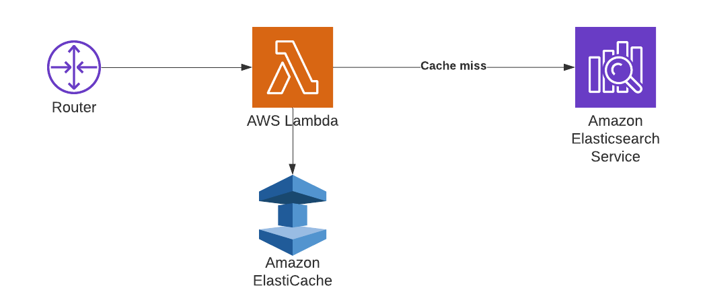

### BestBuy - autocomplete

#### Scenario

Consider BestBuy wants some advice on how to implement an autocomplete feature that provides real-
time, low latency suggestions as a user types in a search phrase for their global user base. They currently
have a product catalogue of around 3 million objects and only want to autocomplete the product name.

#### Minimum requirement
- One recommended architecture and prototype running on public cloud (GCP/AWS) with details on how data flows through the system and descriptions of each component
- with one alternative architecture with pros/cons
- Estimated cloud calculation pricing for each architecture (GCP and AWS)

#### Considerations
- Using open-source tools/technology is preferred
- Serving a global user base with low latency
- What are some ways they could generate the autocomplete data?
- What types of systems could be used to store and serve the autocomplete data? 

#### Data Resources:
- [https://github.com/BestBuyAPIs/open-data-set](https://github.com/BestBuyAPIs/open-data-set)

#### Option 1

#### Option 2

#### Demo

#### Terraform workspaces
- tfstates/provision_vpc_and_eks
- tfstates/deploy_elastic_cluster_resources
- tfstates/deploy_web_cluster_resources

#### Software used
- the latest version of [Terraform](https://www.terraform.io/)
- [wget](https://www.gnu.org/software/wget/), to retrieve terraform modules
- an [AWS account](https://portal.aws.amazon.com/billing/signup?nc2=h_ct&src=default&redirect_url=https%3A%2F%2Faws.amazon.com%2Fregistration-confirmation#/start) with IAM permissions listed on the [EKS module documentation](https://github.com/terraform-aws-modules/terraform-aws-eks/blob/master/docs/iam-permissions.md)
- a configured [AWS CLI](https://docs.aws.amazon.com/cli/latest/userguide/install-cliv2.html)
- [AWS IAM Authenticator](https://docs.aws.amazon.com/eks/latest/userguide/install-aws-iam-authenticator.html)
- [kubectl](https://kubernetes.io/docs/tasks/tools/install-kubectl/)
- [helm](https://helm.sh/), to install kubernetes packages
- [Docker engine](https://docs.docker.com/get-docker/)
