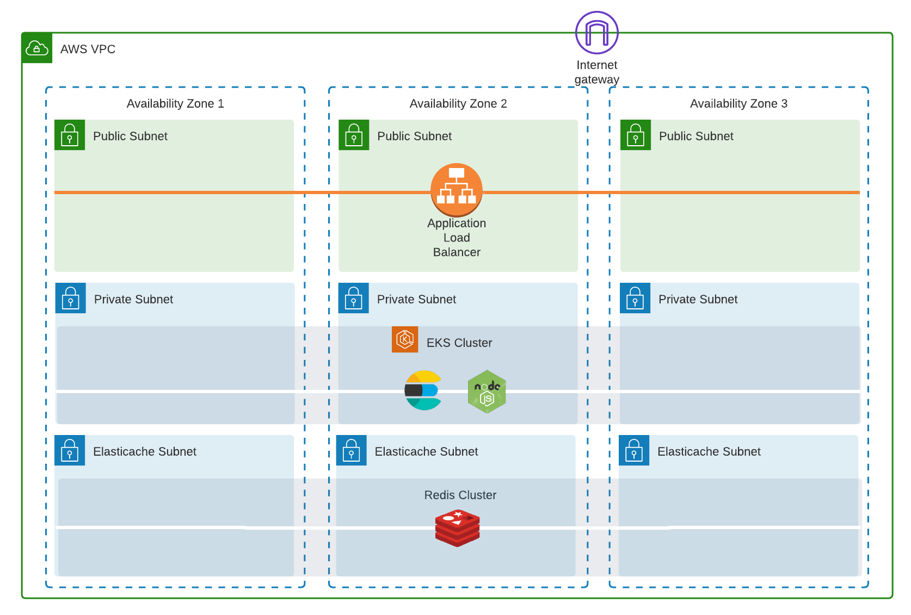

### BestBuy - autocomplete

#### Scenario

Consider BestBuy wants some advice on how to implement an autocomplete feature that provides real-
time, low latency suggestions as a user types in a search phrase for their global user base. They currently
have a product catalogue of around 3 million objects and only want to autocomplete the product name.

#### Minimum requirement

- One recommended architecture and prototype running on public cloud (GCP/AWS) with details on how data flows through the system and descriptions of each component
- with one alternative architecture with pros/cons
- Estimated cloud calculation pricing for each architecture (GCP and AWS)

#### Considerations

- Using open-source tools/technology is preferred
- Serving a global user base with low latency
- What are some ways they could generate the autocomplete data?
- What types of systems could be used to store and serve the autocomplete data?

#### Data Resources:

- Sample dataset: [https://github.com/BestBuyAPIs/open-data-set](https://github.com/BestBuyAPIs/open-data-set)
- Try out [BestBuy's search engine](https://www.bestbuy.com/) for better understanding.

#### CI/CD Flow:

- Use Terraform to build basic infrastructure on public cloud (VPC, Subnet, security group, VMs, k8s, etc)
- Use public gitlab/github to store your code.
- Pack your autocomplete frontend app code in a docker container and deploy it in Kubernetes cluster.
- You can use gitlab-runner or Jenkins as your CICD tools to automate the flow from git => build => deploy in kubernetes cluster.

#### Option 1

#### Demo

#### Software used

- [Terraform](https://www.terraform.io/) v1.0.8
- [kubectl](https://kubernetes.io/docs/tasks/tools/install-kubectl/)
- [helm](https://helm.sh/)
- [Docker engine](https://docs.docker.com/get-docker/)
- [GitLab](https://about.gitlab.com/) repository for CI/CD
